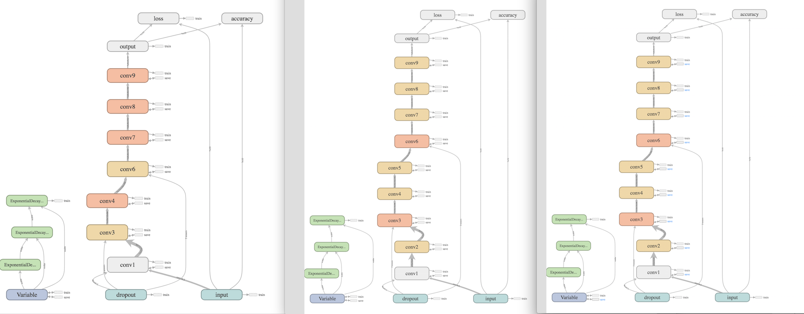
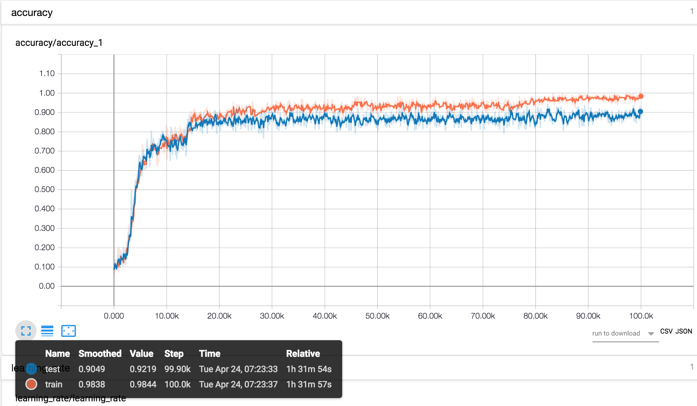
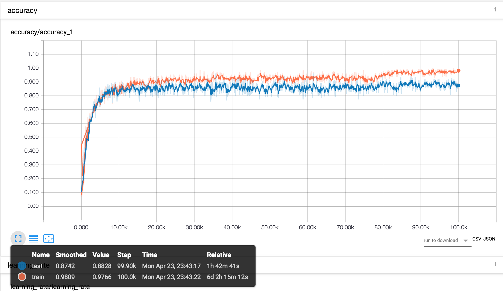
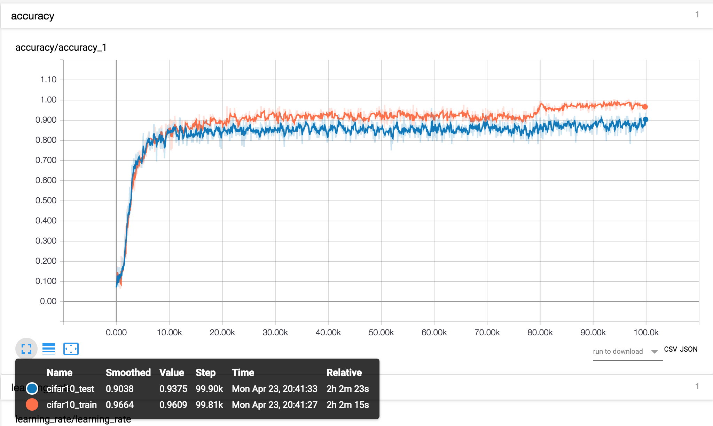

# AllConvNet  

This repository contains implemenation of [STRIVING FOR SIMPLICITY: THE ALL CONVOLUTIONAL NET](https://arxiv.org/pdf/1412.6806.pdf) on the cifar-10 dataset

## Network Graphs for Model A, B and C
  
  

## All-CNN Model A  
*Accuracy*  

## All-CNN Model B    
*Accuracy*  

## All-CNN Model C  
*Accuracy*  

