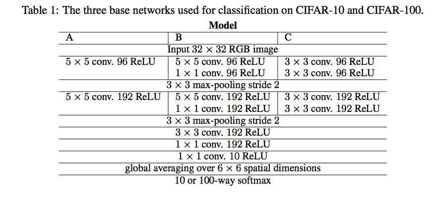

# Image Classification using simpler CNN - AllConvNet  

This repository contains implemenation of [STRIVING FOR SIMPLICITY: THE ALL CONVOLUTIONAL NET](https://arxiv.org/pdf/1412.6806.pdf) on the [CIFAR-10 Dataset](https://www.cs.toronto.edu/~kriz/cifar.html)  

## Image Preprocessing using ZA Whitening  
ZCA Whitening procedure is as explained on this  page [Implementing PCA/Whitening](http://ufldl.stanford.edu/wiki/index.php/Implementing_PCA/Whitening)
```
# Applying global contrast normalize followed by whitening
def global_contrast_normalize(input_x, scale=1., min_divisor=1e-8):
    input_x = input_x - input_x.mean(axis=1)[:, np.newaxis]
    normalizers = np.sqrt((input_x ** 2).sum(axis=1)) / scale
    normalizers[normalizers < min_divisor] = 1.
    input_x /= normalizers[:, np.newaxis]
    return input_x


def compute_zca_transform(images, filter_bias=0.1):
    mean_x = np.mean(images, 0)
    cov_x = np.cov(images.T)
    eigenvalues, eigenvectors = np.linalg.eigh(cov_x + filter_bias * np.eye(cov_x.shape[0], cov_x.shape[1]))
    assert not np.isnan(eigenvalues).any()
    assert not np.isnan(eigenvectors).any()
    assert eigenvalues.min() > 0
    eigenvalues = eigenvalues ** -0.5
    whiten = np.dot(eigenvectors, np.dot(np.diag(eigenvalues), eigenvectors.T))
    return mean_x, whiten


def zca_whiten(train, test, cache=None):
    if cache and os.path.isfile(cache):
        with open(cache, 'rb') as f:
            (mean_x, whiten) = pickle.load(f)
    else:
        mean_x, whiten = compute_zca_transform(train)

        with open(cache, 'wb') as f:
            pickle.dump((mean_x, whiten), f, 2)

    train_whiten = np.dot(train - mean_x, whiten)
    test_whiten = np.dot(test - mean_x, whiten)
    return train_whiten, test_whiten

```
## Network Graphs for Model A, B and C
   

### Model A     ### Model B     ### Model C
  


## All-CNN Model A  
*Accuracy*  


## All-CNN Model B    
*Accuracy*  


## All-CNN Model C  
*Accuracy*  

